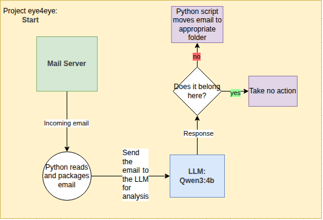

---

# Email Nanny bot - aka eye4ye

---

### Description

Are you getting unwanted emails and dont want to spend time manually blocking or unsubscribing to email content?
This agent reads your email inbox (or potentially all of your inboxes) and performs actions based on its own discretion.
If a spam or non business email comes from the mail server, the agent will move that email to the spam or other folders. 




---

## Functional Requirements 

- Reads incoming emails
- decide if it belongs in the business inbox or not
- Move an email from main inbox to another folder like spam or 'filtered'( a folder that collects suspicious or non business related emails 


## Development lifecyle

1. Brainstorm how the bot will function
2. Begin programming 
3. Test on freindly users
4. Does it meet the functional requirements? if **yes** go to 5. if **no** go to 1.
5. go live and monitor the nanny

## Requirements
| Name | Description |
|------|-------------|
| Python3 | The language libraries you will need [python](https://www.python.org/downloads/) |
| Ollama | Hosts the language model [ollama](https://ollama.com/) |
| Qwen3:4b | The lightweight langauge model you will need [Qwen3:4b](https://ollama.com/library/qwen3.5) |
| Add more | placeholder |

# Linux Setup 
***Only working with IMAP imap.gmail.com type addresses***

1. Install requirements above.
2. Get the source files
   ```bash
   git clone https://github.com/SiddySam/Eye4Eye.git
   ```
3. Setup your email credentials as **environment variables** in your bashrc file
   ```bash
   nano ~/.bashrc
   ```
   Store your credentials locally:
   ```bash
   export e4ePass="<Your google app password>"
   export e4eEmail="<Your email address>"
   ```
   Save and exit then source the changes:
   ```bash
   source ~/.bashrc
   ```
3. Make a new email folder called 'filtered' -this is where the unwated emails will go
4. Launch email_listener.py
   ```bash
   python3 email_listener.py
   ``` 

---

